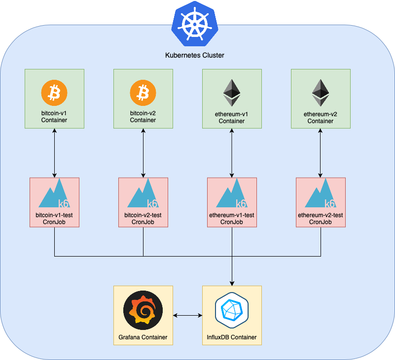

# stresschain

[](https://circleci.com/gh/mazamats/stresschain/tree/master)

Load-testing framework made for blockchain nodes like `bitcoind` and `parity` using the [K6 Performance Testing Tool](https://k6.io). Built for service providers and exchanges that run blockchain nodes at scale which require maximum uptime.

- [stresschain](#stresschain)
  - [Usage](#usage)
    - [Running Tests Locally](#running-tests-locally)
    - [Automated Testing &amp; Reporting](#automated-testing-amp-reporting)
  - [Development](#development)
    - [Project Structure](#project-structure)
    - [Requirements](#requirements)
    - [Adding a new client type](#adding-a-new-client-type)
      - [config.ts](#configts)
      - [stresstest.js](#stresstestjs)
    - [Extending Automated Deploys and Reporting](#extending-automated-deploys-and-reporting)

## Usage

### Running Tests Locally

To run tests locally, use the makefile included with the project. You will need to install [k6](https://docs.k6.io/docs/installation)

`$ make test` runs a single test once, `$ make stresstest` runs with 10 virtual users for 30 seconds. The duration and amount of users can be modified.

- `client`: which client type to test `bitcoin/ethereum/geth`
- `endpoint`: HTTP URL for the node to test
- `users`: Number of users to simulate
- `duration`: How long `stresstest` should run for

Example:

```shell
$ make test client=bitcoin endpoint=${ENDPOINT}
$ make stresstest client=bitcoin endpoint=${ENDPOINT} users=1000

$ make test client=parity endpoint=${ENDPOINT}
$ make stresstest client=parity endpoint=${ENDPOINT} duration=90s

$ make test client=geth endpoint=${ENDPOINT}
$ make stresstest client=geth endpoint=${ENDPOINT} duration=90s users=50
```

### Automated Testing & Reporting

The project is setup to fetch the latest versions of `parity`, `bitcoind`, and `geth` from Github Releases. This happens every 24 hours via CircleCI but can also be run locally using `$ make deploy`

This will deploy a Kubernetes cluster which runs an `InfluxDB` database and `Grafana` frontend for visualizing the reports. (See architecture diagram at the bottom)

Each blockchain client version will deploy the following:

- StatefulSet(Blockchain Client Containers)
- InfluxDB Database
- Grafana Dashboard
- CronJob container that runs loadtests



## Development

### Project Structure

```
stresschain
|
|---- .github                    # CI/CD pipeline config and scripts
|
|---- infra                      # Infrastructure Provisioning code for cluster, clients, and loadtests jobs
|     |---- index.ts             # Wrapper for all resource provisioning
|     |---- clients.ts           # Functions used to build client configs and create blockchain node resources
|     |---- cluster.ts           # Functions used to deploy the Kubernetes cluster, Grafana, and Influx Database
|     |---- loadtest.ts          # Functions used to deploy the K6 Test CronJobs that generate loadtest results
|
|---- clients                    # Parent directory containing client specific directories
|     |---- <CLIENT>
|          |---- config.ts       # Config file for client, used by `infra` for automatic provisioning
|          |---- stresstest.js   # K6 Load Testing file
|
|---- lib                        # Libraries and methods shared across clients
|     |---- github.ts            # Helper for getting version numbers from Github Releases, used by Pulumi
|     |---- jsonRPC.js           # Helper for JSON-RPC requests, used by K6
|     |---- types.ts             # Interface for client configs
|
|---- Dockerfile                 # Custom K6 Container used for running tests in Kubernetes
```

### Requirements

Before running anything, make sure to install the following tooling.

- [K6](https://docs.k6.io/docs/installation)
- [Helm 2](https://helm.sh/docs/intro/install/)
- [Pulumi](https://www.pulumi.com/docs/get-started/install/)
- Node.JS
- Docker
- make (Latest version. On Mac, use `brew install homebrew/core/make`)

### Adding a new client type

To add a new client, create a directory in `clients`. Inside it, we'll need to create a `config.ts` and `stresstest.js`.

Example adding `monero`:

```shell
$ mkdir clients/monero
$ touch clients/monero/config.ts
$ touch clients/monero/stresstest.js
```

#### `config.ts`

The config is a typescript file with a single exported varible (`config`), this config defines the repositories for the client and the download sources (currently only Dockerhub is supported).

There is an interface for building the configs in `lib/types.ts` that should be used.

Example `clients/monero/config.ts`:

```typescript
import { clientArgs } from '../../lib/types';

export const config: clientArgs = {
  name: "monero",                          // Name for the project
  githubRepo: "monero-project/monero",     // Github Repository name
  oldestRelease: "v0.15.0.0",              // Oldest release that will get build/deployed/tested
  container: {                             // Options for running the container
    dataDirSize: "500Gi",                  // Disk space for blockchain data
    dockerRepo: "cornfeedhobo/monero",     // Docker repository name
    command: ["monerod"],                  // Optional, override the `ENTRYPOINT` for the container
    args: [                                // Optional, override the `CMD` for the container
      "--rpcbind=0.0.0.0",
      "--rpcallowip=0.0.0.0/0",
      "--datadir=/data"
    ]
  }
}
```

#### `stresstest.js`

The loadtest script that K6 uses is written in a Golang ES6 engine that is similar to Node.JS. Look at `clients/bitcoin/stresstest.js` for an example and consult the [K6 Documentation](https://docs.k6.io/docs) for more detail.

The only requirement for the loadtest script is to parameterize the endpoint using the `CLIENT_ENDPOINT` environment variable. This allows the tests to be run against arbitrary nodes both in the cluster and locally.

P.S. The K6 JS Engine does not use `process.env`, use `__ENV` instead.

Example:

```javascript
const rpcUrl = __ENV.CLIENT_ENDPOINT
```

### Extending Automated Deploys and Reporting

To add more functionality to the automation, first extend the `clientArgs` interface in `lib/types.ts`.

Afterwards the Pulumi Typescript code inside of `infra` will need to be updated to work with the new interface.

For adding different download sources or creating custom docker builds for cients, only the client deployment code will need to be updated (`infra/clients.ts`).